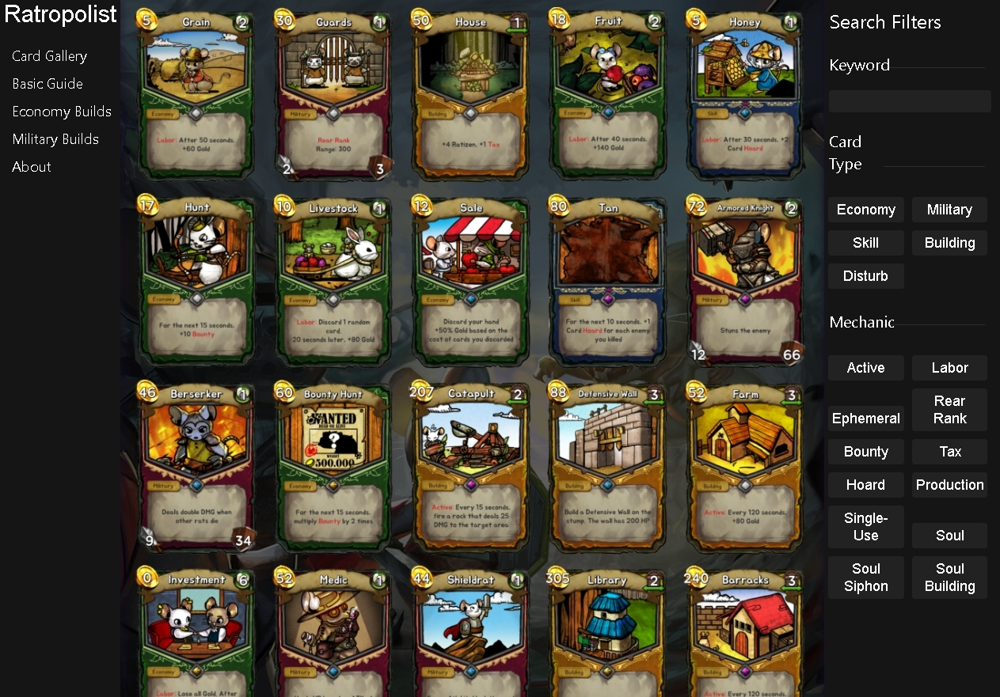

# Ratropolist

Ratropolist is a site that is built for a card-building game called Ratropolis. I found for most new players, including myself at one point, have a hard time grasping what cards to get for two reasons:

1. No idea what cards are available
2. No idea what cards to go/look out for

This site will serve as a resource for those new to the game and guide them what to look out for. This site lists tested strategies and encourages experimentation.

## Requirements
This project is developed with ReactJS, so Node is a requirement in order to run this project.

## Pictures

## Run
Once repository is cloned, use `npm start`. 

